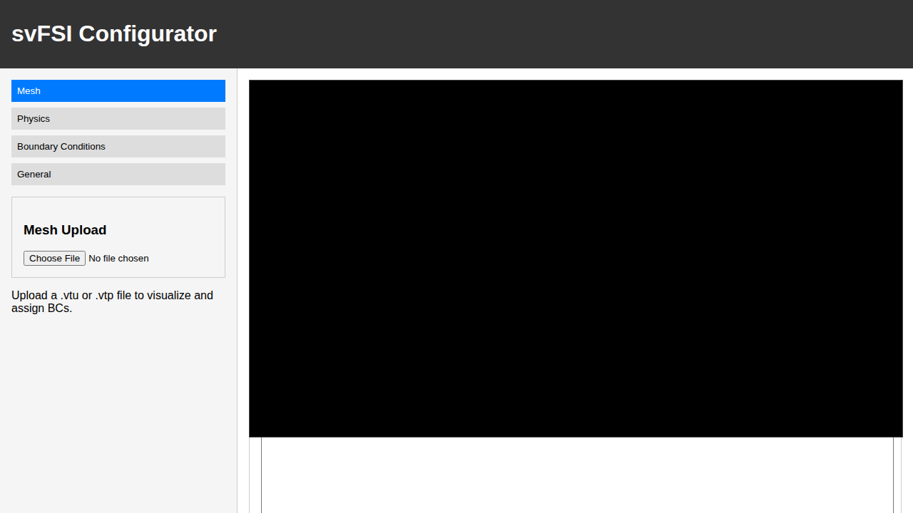
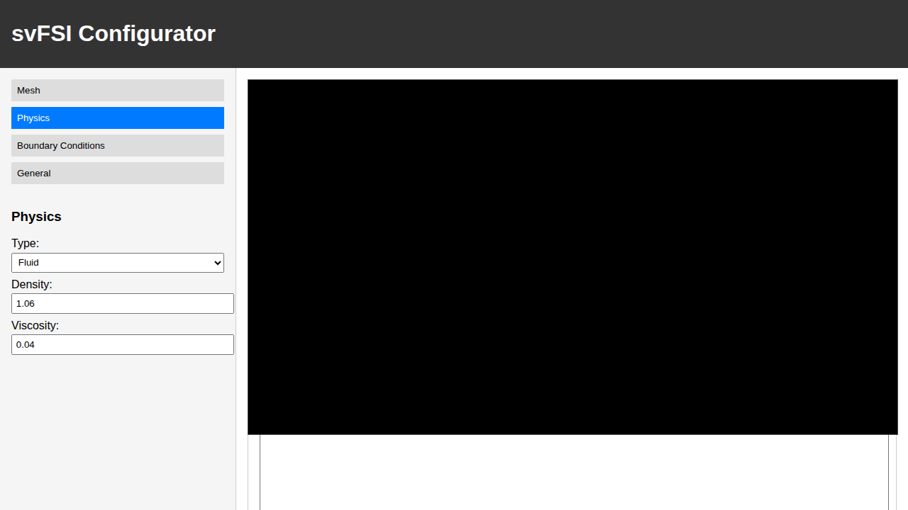
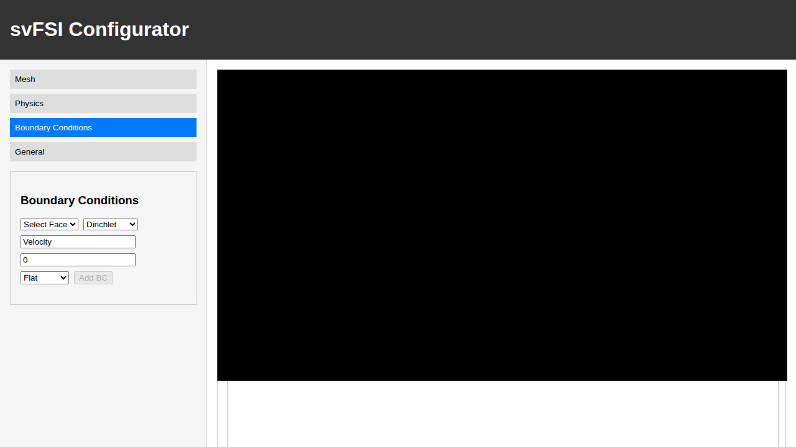
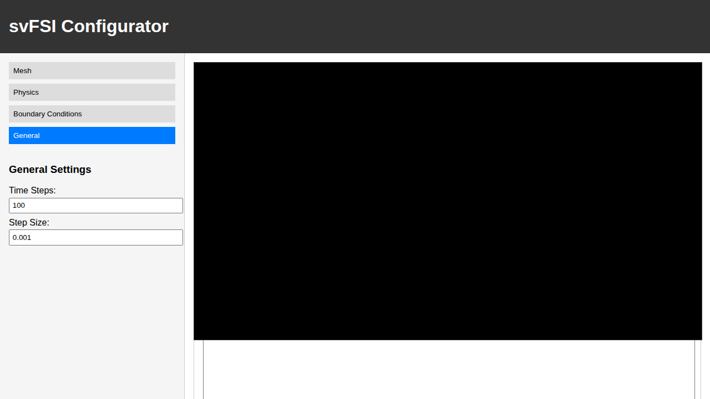

# VascFlow
A modern Frontend and Post-Processing Suite for svFSI, the high-performance multiphysics finite element solver within the SimVascular ecosystem.

## Screenshots

### Mesh Configuration

### Physics Configuration

### Boundary Conditions

### General Configuration

